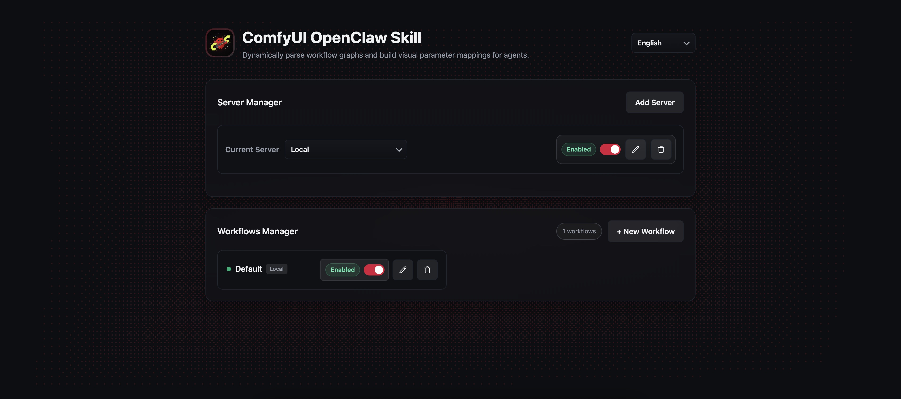

# ComfyUI Skills for OpenClaw


<p>
  <a href="./README.zh.md">
    
  </a>
</p>

This repository is an OpenClaw skill wrapper around ComfyUI workflows.

Its job is not to replace ComfyUI. Its job is to make ComfyUI workflows discoverable and callable by an LLM agent through a stable skill contract:

- OpenClaw discovers the skill through `SKILL.md`
- The agent queries available workflows through `scripts/registry.py list --agent`
- The agent executes a selected workflow through `scripts/comfyui_client.py`
- This project maps agent-friendly arguments onto ComfyUI workflow inputs, submits the job, waits for completion, and downloads the result

In practice, this means you can take a workflow you already built in ComfyUI, expose the few parameters an agent should control, and then let OpenClaw call it with natural language.

## Skill Runtime Contract

From the agent's perspective, this skill exposes two runtime surfaces:

- `scripts/registry.py list --agent`
  Returns the workflows that the agent is allowed to see and call.
- `scripts/comfyui_client.py --workflow <server_id>/<workflow_id> --args '{...json...}'`
  Executes one workflow and returns JSON with generated file paths.

Everything else in this repository exists to support that contract:

- `SKILL.md` tells OpenClaw how to use the skill
- `config.json` defines which ComfyUI or Comfy Cloud servers exist
- `data/<server_id>/<workflow_id>/workflow.json` stores workflow payloads
- `data/<server_id>/<workflow_id>/schema.json` stores the agent-facing parameter mapping
- `ui/` gives you a dashboard for configuring and maintaining those mappings
- `scripts/doctor.py` diagnoses why the skill is not ready or why workflows are hidden

## What This Skill Is Good For

- Turning existing ComfyUI workflows into reusable agent tools
- Letting one agent route image jobs across multiple ComfyUI servers
- Giving the agent a small, explicit parameter surface instead of a full node graph
- Reusing the same mapped workflow repeatedly without rebuilding prompt-to-node wiring
- Running either local/self-hosted ComfyUI instances or Comfy Cloud from the same skill layer

## Quick Start For Skill Usage

If your goal is specifically "make this available to OpenClaw as a skill", the shortest path is:

1. Put the repo under `~/.openclaw/workspace/skills/<skill_name>/`
2. Install Python dependencies from `requirements.txt`
3. Add at least one server to `config.json` or through the Web UI
4. Upload one ComfyUI workflow in **Save (API Format)**
5. Expose the parameters the agent should control
6. Confirm `python scripts/registry.py list --agent` returns at least one workflow
7. Run `python scripts/doctor.py`
8. Confirm `python scripts/comfyui_client.py --workflow ... --args '{...}'` succeeds once

Once those pass, OpenClaw has what it needs.

---

## Installation

### 1) Requirements

- Python 3.10+
- A running ComfyUI server (default: `http://127.0.0.1:8188`)

### 2) Clone and install dependencies

```bash
git clone <your-repo-url> comfyui-skill-openclaw
cd comfyui-skill-openclaw
pip install -r requirements.txt
```

### 3) Prepare runtime config

`config.json` is the runtime config for this project. The CLI, UI, and OpenClaw-facing scripts all use it.

Choose one of these two approaches:

- Manual: create `config.json` from `config.example.json` and fill in your first server yourself
- UI-based (recommended): start the UI first, then add your first server there, and the UI will write it back into `config.json`

`config.json` example:

```json
{
  "servers": [
    {
      "id": "local",
      "name": "Local Mac",
      "server_type": "comfyui",
      "url": "http://127.0.0.1:8188",
      "enabled": true,
      "output_dir": "./outputs",
      "api_key": "",
      "api_key_env": "",
      "use_api_key_for_partner_nodes": false
    },
    {
      "id": "comfy-cloud",
      "name": "Comfy Cloud",
      "server_type": "comfy_cloud",
      "url": "https://cloud.comfy.org",
      "enabled": false,
      "output_dir": "./outputs",
      "api_key": "",
      "api_key_env": "COMFY_CLOUD_API_KEY",
      "use_api_key_for_partner_nodes": true
    }
  ],
  "default_server": "local"
}
```

For Comfy Cloud, prefer `api_key_env` over `api_key` so the real key stays out of `config.json`.

Here `Comfy Cloud` means Comfy's official hosted remote/cloud runtime.
If you are connecting to your own self-hosted remote ComfyUI instance, even on a cloud VM, it should usually be configured as a regular `comfyui` server rather than `comfy_cloud`.


### 4) Start the local UI

- macOS/Linux:
  ```bash
  ./ui/run_ui.sh
  ```
  or double-click `ui/run_ui.command`
- Windows:
  ```bat
  ui\run_ui.bat
  ```

Then open:

- `http://localhost:18189`

Frontend developer workflow:

- users do not need Node or a frontend build step
- committed build assets are served directly from `ui/static/`
- frontend source lives in `frontend/`

```bash
cd frontend
npm install
npm test
npm run build
```

`npm run build` regenerates `ui/static/` for FastAPI to serve.

### 5) Add your first server and workflow

In the UI:

1. If you have not already configured a server in `config.json`, add a ComfyUI server first.
2. Upload a workflow exported from ComfyUI via **Save (API Format)**.
3. Expose the parameters you want the agent to use.
4. Save the workflow mapping.

### 6) Verify the skill contract

Check what the agent will see:

```bash
python scripts/registry.py list --agent
```

Run one test execution:

```bash
python scripts/comfyui_client.py \
  --workflow local/test \
  --args '{"prompt":"A premium product photo on aged driftwood, warm cinematic light","size":"3:4,1728x2304","seed":20260307}'
```

If successful, output JSON includes local image path(s), for example:

```json
{
  "status": "success",
  "prompt_id": "...",
  "images": ["./outputs/<prompt_id>_...png"]
}
```

Run a readiness diagnosis:

```bash
python scripts/doctor.py
```

---

## Install As An OpenClaw Skill

Put this repository under your OpenClaw workspace skill directory:

- `~/.openclaw/workspace/skills/<skill_name>/`

For example:

- `~/.openclaw/workspace/skills/comfyui-agent/`

OpenClaw will read `SKILL.md` and call:

- `scripts/registry.py list --agent`
- `scripts/comfyui_client.py --workflow ... --args '...json...'`

### Discovery checklist

OpenClaw can only use the skill correctly if all of these are true:

1. The project is placed under `~/.openclaw/workspace/skills/`.
2. `SKILL.md` exists at the project root.
3. Python dependencies are installed.
4. `config.json` contains at least one reachable enabled server.
5. At least one enabled workflow/schema pair exists under `data/<server_id>/`.
6. `scripts/registry.py list --agent` returns the workflow you expect.
7. `scripts/doctor.py` does not report blocking errors.

### What OpenClaw actually calls

The agent interaction loop is:

1. Read `SKILL.md`
2. Call `python ./scripts/registry.py list --agent`
3. Pick a workflow based on user intent and exposed parameters
4. Assemble JSON args
5. Call `python ./scripts/comfyui_client.py --workflow <server_id>/<workflow_id> --args '{...}'`
6. Read returned JSON and use the image path(s)

If you are debugging "why the skill is not working in OpenClaw", those are the first places to inspect.

For a stricter contract reference, see [docs/AGENT_CONTRACT.md](./docs/AGENT_CONTRACT.md).

### AI-Native Install Via Agent

You can also ask an OpenClaw Agent to install this skill for you.

Use a prompt like this:

```text
Please install this ComfyUI skill into my OpenClaw workspace.

Target path:
~/.openclaw/workspace/skills/comfyui-agent/

Requirements:
1. Copy or clone the full project into that directory.
2. Keep SKILL.md at the project root.
3. Install Python dependencies from requirements.txt.
4. Create config.json from config.example.json if missing.
5. Set the default ComfyUI server URL to http://127.0.0.1:8188 unless I specify another one.
6. Make sure the skill can be discovered by OpenClaw after installation.
```

---

## Local Dashboard (UI)

Start dashboard:

- Via OpenClaw or any agent that can run local commands:
  ```bash
  python3 ./ui/open_ui.py
  ```
- macOS/Linux:
  ```bash
  ./ui/run_ui.sh
  ```
  or double-click `ui/run_ui.command`
- Windows:
  ```bat
  ui\run_ui.bat
  ```

Then open:

- `http://localhost:18189`

Use it to configure ComfyUI server URLs, outputs, and manage workflow/schema mapping.

Current highlights:

- Multi-server management with per-server and per-workflow enable/disable controls
- Dedicated `Comfy Cloud` config tab with API key or env-var based auth
- Workflow search, sort, and drag-to-reorder
- Upload workflow JSON and auto-fill workflow ID
- Custom dialogs, dropdowns, and language switching for daily editing

---

## Multi-Server Management

You can now configure multiple ComfyUI servers, enabling your agent to dispatch workflows across different hardware (e.g., local machines, cloud A100s).

### Concept
- **Dual-Layer Toggles**: Both *servers* and *individual workflows* can be enabled or disabled. A workflow is only visible to the AI agent if **both** the server and the workflow itself are enabled.
- **Namespacing**: Workflows are identified with a composite ID: `<server_id>/<workflow_id>` (e.g., `local/sdxl-base` vs. `cloud-a100/sdxl-base`).

### Configuration via CLI
A built-in CLI tool (`scripts/server_manager.py`) allows server management on headless Linux machines:
```bash
python scripts/server_manager.py list
python scripts/server_manager.py add --id cloud --name "Cloud Node" --url http://10.0.0.1:8188
python scripts/server_manager.py add --id comfy-cloud --type comfy_cloud --api-key-env COMFY_CLOUD_API_KEY
python scripts/server_manager.py disable cloud
```
*You can also manage servers fully via the Web UI.*

### Comfy Cloud
When adding or editing a server in the Web UI, switch to the `Comfy Cloud` tab. That tab stores the Cloud base URL plus one of:

- `api_key`: direct key in `config.json`
- `api_key_env`: environment variable name such as `COMFY_CLOUD_API_KEY`

Optional:

- `use_api_key_for_partner_nodes: true` to forward the same key into `extra_data.api_key_comfy_org`

The runtime call flow is:

1. `POST /api/prompt`
2. `GET /api/job/{prompt_id}/status`
3. `GET /api/history_v2/{prompt_id}` (with a collection fallback if needed)
4. `GET /api/view` and follow the signed redirect for downloads

Out-of-the-box Cloud workflow support:

- When you add a new `comfy_cloud` server, OpenClaw now auto-installs the bundled starter workflow set for that server.
- The bundled workflows are tagged as `Bundled Cloud` in the registry/UI metadata.
- You can inspect or import templates manually with:

```bash
python scripts/cloud_templates.py list --source bundled
python scripts/cloud_templates.py list --source official
python scripts/cloud_templates.py import --server comfy-cloud --source bundled --template text_to_image_square
python scripts/cloud_templates.py import --server comfy-cloud --source official --template text_to_image --workflow-id official-text-to-image
```

Notes:

- Official Comfy Cloud `global_subgraphs` are blueprint/subgraph definitions, not directly executable API-format workflows.
- OpenClaw currently exposes them for discovery and enables direct runnable import only for curated supported templates such as `text_to_image`.

---

## Workflow Requirements (Important)

To ensure a workflow can be executed by this skill reliably:

1. **Export ComfyUI workflow in API format**
   - In ComfyUI, click **Save (API Format)**.
   - Use that exported JSON in `data/<server_id>/<workflow_id>/workflow.json`.

2. **Expose only parameters the agent should control**
   - The schema mapping should present business-facing fields like `prompt`, `seed`, `size`, `style`, `negative_prompt`.
   - Avoid exposing raw node implementation details unless they are truly useful to the agent.
   - The registry now also supports optional `default`, `example`, and `choices` metadata for agent guidance.

3. **The final output path should include a downloadable output node**
   - For local ComfyUI this is typically `Save Image`.
   - For Comfy Cloud or custom workflows, the execution history still needs to contain downloadable output metadata.
   - Without output metadata, the job may finish but the skill cannot return files.

In short: **API-format workflow + clean schema mapping + downloadable output** are required for stable agent usage.

---

## Known Caveats

- If `scripts/registry.py list --agent` returns nothing, the agent has nothing to call.
- Use `python scripts/registry.py list --agent --all --debug` to inspect hidden workflows and invalid schema reasons.
- If ComfyUI returns HTTP 400 on `/prompt`, the workflow payload or parameter value is usually invalid.
- `size` must match values accepted by the underlying node (e.g. `3:4,1728x2304`).
- If `config.json` points to the wrong server URL, job queueing will fail.
- If a server or workflow is disabled, it disappears from the agent-visible registry even if files still exist on disk.

## Examples

Illustrative example assets live in `examples/`:

- `examples/workflow_api.example.json`
- `examples/schema.example.json`
- `examples/registry-agent-output.example.json`
- `examples/doctor-output.example.txt`

These examples document the skill contract shape. They are not guaranteed to be executable in every ComfyUI environment.

---

## Roadmap (next)

- Workflow version history and rollback
- Upgrade preview before applying a new workflow version
- Parameter migration support when upgrading a workflow
- Better schema validation before queueing
- Richer error reporting from ComfyUI node errors
- Optional batch generation / multi-seed helpers

---

## Project Structure

```text
ComfyUI_Skills_OpenClaw/
├── SKILL.md                    # Agent instruction spec (how to call registry/client)
├── README.md
├── README.zh.md
├── LICENSE
├── .gitignore
├── requirements.txt            # Python deps (FastAPI, requests, etc.)
├── config.example.json         # Example runtime config
├── config.json                 # Actual local runtime config (gitignored)
├── asset/
│   └── banner-ui-20250309.jpg
├── data/
│   ├── <server_id>/
│   │   ├── workflows/
│   │   │   └── <workflow_id>.json  # ComfyUI workflow API export
│   │   └── schemas/
│   │       └── <workflow_id>.json  # Exposed parameter mapping
├── scripts/
│   ├── server_manager.py       # CLI tool for managing servers
│   ├── registry.py             # List workflows + exposed parameters for agent
│   ├── comfyui_client.py       # Inject args, queue prompt, poll history, download images
│   └── shared/                 # Shared config & JSON utils (reused across scripts)
│       ├── config.py
│       ├── json_utils.py
│       └── runtime_config.py
├── ui/
│   ├── app.py                  # FastAPI app – routes only
│   ├── open_ui.py              # Agent-friendly UI launcher
│   ├── services.py             # Business logic (workflow CRUD)
│   ├── models.py               # Pydantic request/response models
│   ├── json_store.py           # Low-level JSON file read/write helpers
│   ├── settings.py             # App-level settings
│   ├── run_ui.sh               # Start UI (macOS/Linux)
│   ├── run_ui.command          # Double-click launcher (macOS)
│   ├── run_ui.bat              # Launcher (Windows)
│   └── static/                 # Built frontend assets served directly by FastAPI
├── frontend/                   # React + TypeScript + Vite source for UI development
└── outputs/
    └── .gitkeep
```

---

<details>
<summary>Project Keywords And Resources</summary>

## Project Keywords

This repository is optimized around these search intents:

- OpenClaw
- ComfyUI
- ComfyUI Skills
- ComfyUI workflow automation
- OpenClaw ComfyUI integration
- AI image generation skill
- Xiao Long Xia (small crawfish / 小龙虾, project nickname)

Related files for project understanding and retrieval:
- `README.md` (English overview)
- `README.zh.md` (Chinese overview)
- `SKILL.md` (agent execution contract)
- `docs/llms.txt` and `docs/llms-full.txt` (LLM-oriented summaries)

---

## Project Resources

- Project summary: `docs/llms.txt`
- Extended project context: `docs/llms-full.txt`
- Project discovery checklist: `docs/PROJECT_DISCOVERY_CHECKLIST.md`

</details>
